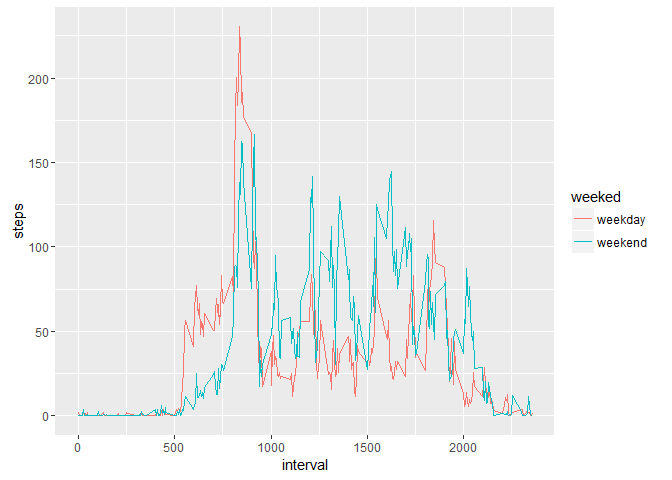

# Reproducible Research: Peer Assessment 1

## Set Folder, Loading packages, library, global parameters to knitr

A very andy package was *timeDate*, have a function `<isWeekend()>` return TRUE or FALSE. 

```r
library(timeDate)
library(ggplot2)
```


```r
#set my working folder, DON'T FORGET REPLACE
setwd("C:/Users/danilo.verdugo/Dropbox/personal/COURSERA DATA SCIENTIST/curso 5/semana 2/tarea")
```

## Loading and preprocessing the data
Show any code that is needed to:  
&nbsp;&nbsp;1. Load the data (i.e. read.csv())  
&nbsp;&nbsp;2. Process/transform the data (if necessary) into a format suitable for your analysis  


```r
#set pathfile to data
fileurl <- "https://d396qusza40orc.cloudfront.net/repdata%2Fdata%2Factivity.zip"

#download, I use windows SO, then not curl method.
download.file( fileurl, "activity.zip")  

#extract file to working folder
unzip(zipfile="activity.zip")

#Get my data object named activity.
activity <- read.csv("activity.csv")
```
  
  
## What is mean total number of steps taken per day?
For this part of the assignment, **you can ignore the missing values** with `<na.rm = TRUE>` in the dataset.
  
&nbsp;&nbsp;1. Make a histogram of the **total** number of steps taken **each** day  
&nbsp;&nbsp;2. Calculate and report the **mean** and **median** total number of steps taken per day  

```r
#aggregate steps by date with data activity
#cuento total de steps mediante sum y los calculo por date, remuevo NA
steps.date <- aggregate(steps ~ date, data = activity, FUN = sum)
barplot(steps.date$steps, names.arg = steps.date$date, xlab = "date", ylab = "total steps by day",main = "total number steps by date.")
```

<!-- -->

Extract mean and median:

```r
mean(steps.date$steps, na.rm=TRUE)
```

```
## [1] 10766.19
```

```r
median(steps.date$steps, na.rm=TRUE)
```

```
## [1] 10765
```


## What is the average daily activity pattern?
&nbsp;&nbsp;1. Make a time series plot (i.e. `<type = "l">`) of the 5-minute interval (x-axis) and the **average** number of steps taken, averaged across all days (y-axis)  
&nbsp;&nbsp;2. Which 5-minute interval, on average across all the days in the dataset, contains the maximum number of steps?  


```r
steps.interval <- aggregate(steps ~ interval, data = activity, FUN = mean)
plot(steps.interval, type = "l")
```

<!-- -->

Interval with maximum number of steps:

```r
steps.interval$interval[which.max(steps.interval$steps)]
```

```
## [1] 835
```


## Imputing missing values
Note that there are a number of days/intervals where there are missing values (coded as `<NA>`). The presence of missing days may introduce bias into some calculations or summaries of the data.  

Calculate and report the total number of missing values in the dataset (i.e. the total number of rows with NAs)

```r
sumna <- sum(is.na(activity))
```
The number of NA: **2304**
  

Devise a strategy for filling in all of the missing values in the dataset. The strategy does not need to be sophisticated. For example, you could use the mean/median for that day, or the mean for that 5-minute interval, etc.  
  

```r
#The solution was merge to activity data.frame, values contain in "steps.interval" using "interval" key.  Add column steps.tmp with values.
activity.filled <- merge(activity, steps.interval, by = "interval", suffixes = c("", ".tmp"))
#build logical vector with NA 
nas <- is.na(activity.filled$steps)
#fill steps field with new column
activity.filled$steps[nas] <- activity.filled$steps.tmp[nas]
#remove last column retrieving 1:3
activity.filled <- activity.filled[, c(1:3)]
```

I want check results:

```r
sum(is.na(activity.filled))
```

```
## [1] 0
```

Create a new dataset that is equal to the original dataset but with the missing data filled in.

```r
#make new dataset
steps.date.filled <- aggregate(steps ~ date, data = activity.filled, FUN = sum)
```

Make a histogram of the total number of steps taken **each day**

```r
barplot(steps.date.filled$steps, names.arg = steps.date.filled$date, xlab = "date", ylab = "total steps by day",main = "Number steps by date.")
```

<!-- -->

Calculate and report the mean and median total number of steps taken per day:

```r
mean(steps.date.filled$steps, na.rm=TRUE)
```

```
## [1] 10766.19
```


```r
median(steps.date.filled$steps, na.rm=TRUE)
```

```
## [1] 10766.19
```

Do these values differ from the estimates from the first part of the assignment?  
&nbsp;&nbsp;&nbsp;&nbsp;***Not Really*** the same values was obtain with NA erased.


What is the impact of imputing missing data on the estimates of the total daily number of steps?  
&nbsp;&nbsp;&nbsp;&nbsp;***NULL impact*** mean over mean is zero.


## Are there differences in activity patterns between weekdays and weekends?
*dataset filled was used in this time*  
I use a different approach, the "isWeekend" function on package timedate return TRUE or FALSE.

```r
#build vector with type of day
weeked <- ifelse(isWeekend((activity.filled$date)), "weekend", "weekday")
#append column with type to my dataset
final <- data.frame(activity.filled,weeked)
```


```r
#aggregate by interval using mean
average_steps <- aggregate(steps ~ weeked + interval, data = final,mean)
```


```r
#histogram with two panel with results
qplot(interval, steps, data = average_steps, facets = weeked~., geom = "line")
```

<!-- -->
  
### On weekday tend to walk more in the morning, while the weekend is more quiet or walk less  
  

```r
#two layer, better visualization
qplot(interval, steps, data = average_steps, color = weeked, geom = "line")
```

<!-- -->

